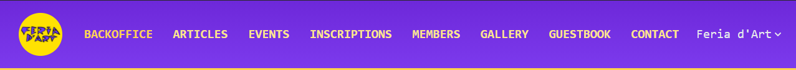
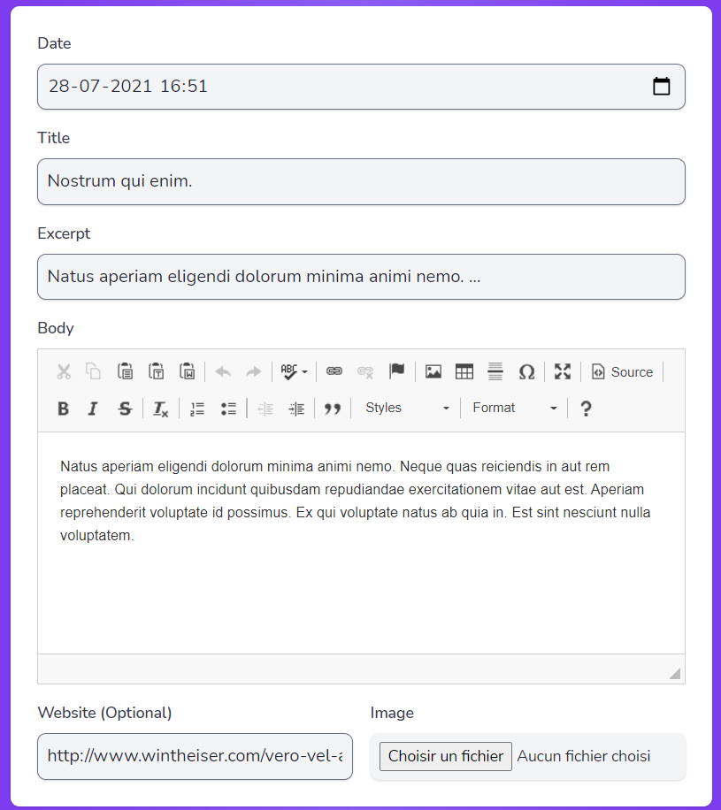
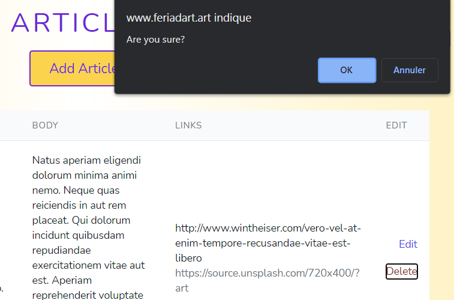
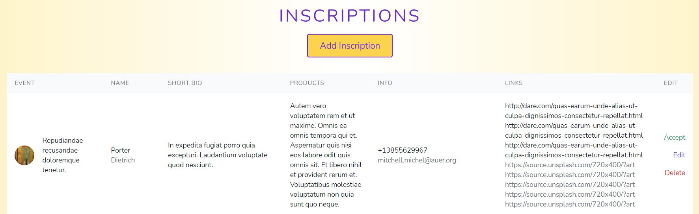
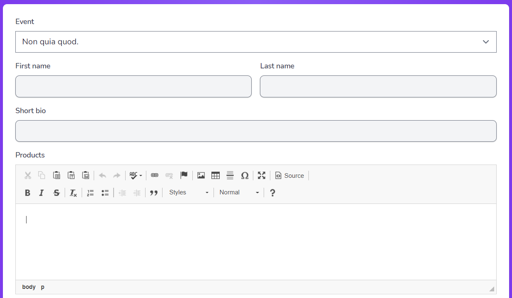
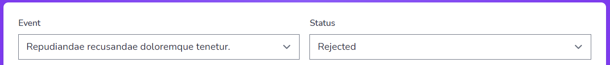

## BACKOFFICE

To access the administrator Backoffice you have to click over the small "head with a hat" icon in the footer of the page. This will make visible a "Login" button. (The login/registration system has been implemented with [Laravel Breeze](https://github.com/laravel/breeze)).

When you click the "Login" button you'll be redirected to the login form where you should put your admin credentials. For the moment it is not possible to register a new user. 

Then you will enter the backoffice panel which is composed of 8 sections and 2 clickable buttons. The "Logo" button at the left takes you back to the Frontpage and the "Username" drop-down button at the right allows you to log out from the Backoffice.

### BACKOFFICE (WELCOME) page

For the moment, the "Backoffice" section only shows you a welcome message but we could add some other functionalities in the future such as the option to change the current password.

### ARTICLES page

In the "Articles" section, the admin can manage the Article elements. Articles are shown according to the "created_at" value from newest to oldest.

    - You can create a new Article that will be added to the "Articles" section in the Frontpage. All the fields are required except for the "URL". The picture will be also copied to the public "images/articles" folder and it has a size limit of 5MB. When you create an Article the "article_date" value is assigned automatically according to the date/time it was created but you can change it afterwards. This date will affect the "Latest Articles" section shown in the "Home" frontpage. 

    - You can edit existing Articles content.

    
    - You can delete existing Articles. A confirm message will pop-up when you hit the "Delete" button. This will also automatically delete the image associated to the Article in the public "images/articles" folder.

### EVENTS page

In the "Events" section, the admin can manage the Event elements. Events are shown according to the "date_start" value from newest to oldest.

    - You can create a new Event that will be added to the "Events" section in the Frontpage. All the fields are required. The pictures will be also copied to the public "/images/events" folder and they have a size limit of 5MB each. When you create an Event the "start_date" value will affect the "Next Events" section shown in the "Home" frontpage. Events are created with a default inscription "Status" of "CLOSED" so if you want people to be able to inscribe to this Event you need to manually change the "Status" to "OPEN" afterwards. This value will affect the "Featured Event" shown in the "Home" frontpage section. If you have multiple Events "OPEN" for inscription at the same time, the "Featured Event" shown will be the one with the lowest "start_date". There are 2 fields named "Inscription image" and "Inscription text" which are shown in this "Featured Event" section. 

    - You can edit existing Events content. Here you can change the inscription "Status" of the Event between "OPEN" and "CLOSED". You can also quickly open an Event for inscriptions by clicking on the "Open" button next to each Event. If the Event is already open the button will dissappear.

    - You can delete existing Events. A confirm message will pop-up when you hit the "Delete" button. This will also automatically delete the images associated to the Event in the public "images/events" folder.

### INSCRIPTIONS page

In the "Inscriptions" section, the admin can manage the Artists Inscription elements. Inscriptions are shown according to the "created_at" value from newest to oldest.

    - You can create a new Artist Inscription associated to a certain Event. There are many optional fields, but the Artist always has to upload at least 1 picture. The pictures will be also copied to the public "/images/inscriptions" folder and they have a size limit of 5MB each. Inscriptions are created with a default inscription "Status" of "Rejected" so you need to manually change the "Status" to "Accepted" afterwards. This value will affect the "View Artists" section shown in each frontpage Event. Also, only "Accepted" Artists will be shown in the "Featured Artist" section in the "Home" frontpage. 

    - You can edit existing Inscriptions content. Here you can change the "Status" of the Inscription between "Accepted" and "Rejected". You can also quickly accept an Inscription by clicking on the "Accept" button next to each Inscription. If the Inscription is already accepted the button will dissappear.

    - You can delete existing Inscriptions. A confirm message will pop-up when you hit the "Delete" button. This will also automatically delete the images associated to the Inscription in the public "images/inscriptions" folder.
### MEMBERS page

In the "Members" section, the admin can manage the Member elements. Members are shown according to the "created_at" value from newest to oldest.

    - You can create a new Member of the team that will be added to the "About" section in the Frontpage. All fields are required except for the url links. The picture will be also copied to the public "/images/members" folder and it has a size limit of 5MB. 

    - You can edit existing Members content.

    - You can delete existing Members. A confirm message will pop-up when you hit the "Delete" button. This will also automatically delete the image associated to the Member in the public "images/members" folder.
### GALLERY page

### GUESTBOOK page

### CONTACT page
