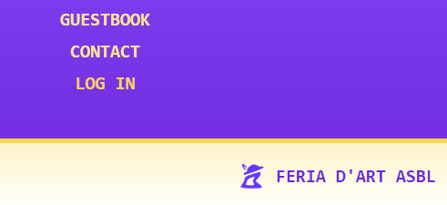
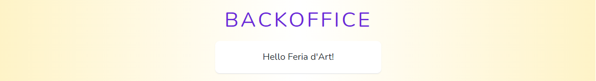
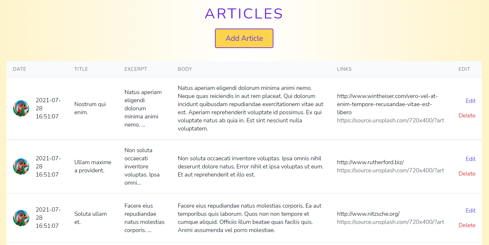

### Backoffice

To access the administrator Backoffice you have to click over the small "head with a hat" icon in the footer of the page. This will make visible a "Login" button. (The login/registration system has been implemented with [Laravel Breeze](https://github.com/laravel/breeze)).

When you click the "Login" button you'll be redirected to the login form where you should put your admin credentials. For the moment it is not possible to register a new user. 

Then you will enter the backoffice panel which is composed of 7 sections.

1. For the moment, the "Backoffice" section only shows you a welcome message but we could add some other functionalities in the future such as the option to change the current password.

2. In "Articles" section, the admin can manage the Article elements. Articles are shown according to the "created_at" value from newest to oldest.

    

    - He can create a new Article that will be added to the "Articles" section in the Frontpage. All the fields are required except for the "URL". The picture will be also copied to the public folder /images/articles and it has a size limit of 5MB. When you create an Article the "article_date" value is assigned automatically according to the date/time it was created but you can change it afterwards (this date will affect the "Latest Articles" shown in in the "Home" frontpage section). 

    

    - He can edit existing Articles content.

    
    
    - He can delete existing Articles. A confirm message will pop-up when you hit the "Delete" button. This will also automatically delete the image associated to the article in the public images/articles folder.

    
