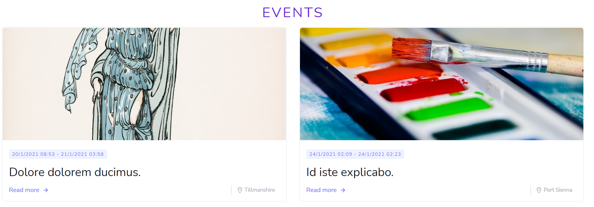

#  FERIA D'ART 

[See the actual site!](https://feriadart.art/)

The site has 4 different domain names: feriadart.org, feriadart.fr , feriadart.be and feriadart.art
all of them are redirected to https://feriadart.art/

The site was created for a non-profit art promoting association located in Brussels. It was made by 4 WebDev students of BeCode (campus Bruxelles). The challenge was to create a website for a real client. This particular project created in group started from scratch.

| [Christian Jadot](https://github.com/ChristianJadot) | [Marc Houtreille](https://github.com/MarcHoutreille) | [Robbert Klockaerts](https://github.com/robbertklockaerts) | [Marcelo Romero-Cors](https://github.com/luisromeroaraya) |

## TECHNOLOGIES USED

The website was built in [Laravel](https://laravel.com/) using [Tailwind CSS](https://tailwindcss.com/) as an easy way to style HTML elements. 

Additionaly we used a little of [JavaScript](https://www.javascript.com/) to trigger some button events.

#### How to install this project in your computer through Linux Terminal
1. clone the repo to your computer
2. $ cd ASBL-Feriadart
3. $ composer install
4. $ npm install
5. $ cp .env.example .env
6. $ php artisan key:generate
7. $ php artisan serve

## FRONTPAGE

We styled the website using as a reference a yellow/purple Logo that they were already using for their [Facebook page](https://www.facebook.com/FeriadArt/).

We were able to create the site favicon thanks to [Favicon.io](https://favicon.io)

### MENU

The main menu is composed of 8 sections and 2 clickable buttons.

The "Logo" button at the left takes you "Home" and the language drop-down button at the right allows you to change the interface language between English, French and Dutch (EN/FR/NL). This was possible thanks to [this tutorial](https://5balloons.info/localization-laravel-multi-language-language-switcher/) and the use of this [Laravel translations](https://github.com/Laravel-Lang/lang/tree/master/locales). We also had to translate everything that was not included in the default translations.

The menu is also responsive:

### HOME

The "Home" section is separated in 4 main components:

1. The "Featured Artist" component shows you a picture (work of an artist) plus information about a random Artist who is subscribed (and accepted) to any Event. Everytime you reload the page another Artist will appear. When you click the "View more" button, you will be redirected to the Artist's page where you can see more of its work and get more detailed info.

2. The "Featured Event" component shows you the next upcoming Event "Open" for inscriptions. If you click the "Learn more" button you can get more info about that Event and subscribe yourself.

3. The "Next Events" component shows you up to 3 upcoming Events showing you the date, name, poster, place and current inscription status (Open/Closed). It also gives you a link to the Events section.

4. The "Latest Articles" component shows you the last 2 Articles published and a link to the Articles section.

### ABOUT page

On the "About" page you can find info about the organization and the Members currently participating in it.
They each have a card with personal info and links to their personal websites.

### EVENTS page

Here you will find links to all present and past Events ordered by theirs "date_start" value from newest to oldest. If you click on any Event you can get to see 3 more sub-sections: Event page, View Artists page and Artist page.

#### Event sub section

The event page contains all the info of the Event and 2 buttons: "Inscription" and "View Artists". The "Inscription" button is only available if the Event has an inscription "Status" of "Open". If the button is available and you click on it you will see a form demanding all the info they need for your inscription. When the Artist sends the form it has to wait for the Admin to accept its inscription.

#### View Artists sub section

If you click on the "View Artists" button you can have a look at all the artists who are already accepted to that specific Event. 

#### Artist sub section

If you click on an "Artist" card you will see a personal page with more info and a small carousel with up to 5 pictures. We used [Glide.js](https://glidejs.com/) to create this carousel. 

### GALLERY page

On the "Gallery" page you will find a list of all present and future Events ordered by theirs "date_start" value from newest to oldest.

If you click over an Event you can have a look at all the Pictures that have been uploaded for that Event. We used [Glide.js](https://glidejs.com/) to create the Event Gallery carousel. 

### GUESTBOOK page

The "Guestbook" page shows all the comments left by people visiting the site. You can leave your personal comment on the wall. Once accepted by the Admin it will appear as well.

### CONTACT page

This page gives you the possibility to interact with the organization. It's a simple contact form that you will need to fill in to get in touch with Feria d'Art.

### FOOTER

The "Footer" has links to all the sections of the frontpage as well as social media links. At the bottom you will find some legal and contact info.

## BACKOFFICE

To access the administrator Backoffice you have to click over the small "head with a hat" icon in the footer of the page. This will make visible a "Login" button. (The login/registration system has been implemented with [Laravel Breeze](https://github.com/laravel/breeze)).

When you click the "Login" button you'll be redirected to the login form where you should put your admin credentials. For the moment it is not possible to register a new user. 

Then you will enter the backoffice panel which is composed of 8 sections and 2 clickable buttons. The "Logo" button at the left takes you back to the Frontpage and the "Username" drop-down button at the right allows you to log out from the Backoffice.

### BACKOFFICE (WELCOME) page

For the moment, the "Backoffice" section only shows you a welcome message but we could add some other functionalities in the future such as the option to change the current password.

### ARTICLES page

In the "Articles" section, the admin can manage the Article elements. Articles are shown according to the "created_at" value from newest to oldest.

- You can create a new Article that will be added to the "Articles" section in the Frontpage. All the fields are required except for the "URL". The picture will be also copied to the public "images/articles" folder and it has a size limit of 5MB. When you create an Article the "article_date" value is assigned automatically according to the date/time it was created but you can change it afterwards. This date will affect the "Latest Articles" section shown in the "Home" frontpage. 

- You can edit existing Articles content.

    
- You can delete existing Articles. A confirm message will pop-up when you hit the "Delete" button. This will also automatically delete the image associated to the Article in the public "images/articles" folder.

### EVENTS page

In the "Events" section, the admin can manage the Event elements. Events are shown according to the "date_start" value from newest to oldest.

- You can create a new Event that will be added to the "Events" section in the Frontpage. All the fields are required. The pictures will be also copied to the public "/images/events" folder and they have a size limit of 5MB each. When you create an Event the "start_date" value will affect the "Next Events" section shown in the "Home" frontpage. Events are created with a default inscription "Status" of "CLOSED" so if you want people to be able to inscribe to this Event you need to manually change the "Status" to "OPEN" afterwards. This value will affect the "Featured Event" shown in the "Home" frontpage section. If you have multiple Events "OPEN" for inscription at the same time, the "Featured Event" shown will be the one with the lowest "start_date". There are 2 fields named "Inscription image" and "Inscription text" which are shown in this "Featured Event" section. 

- You can edit existing Events content. Here you can change the inscription "Status" of the Event between "OPEN" and "CLOSED". You can also quickly open an Event for inscriptions by clicking on the "Open" button next to it. If the Event is already open the button will dissappear.

- You can delete existing Events. A confirm message will pop-up when you hit the "Delete" button. This will also automatically delete the images associated to the Event in the public "images/events" folder.

### INSCRIPTIONS page

In the "Inscriptions" section, the admin can manage the Artists Inscription elements. Inscriptions are shown according to the "created_at" value from newest to oldest.

- You can create a new Artist Inscription associated to a certain Event. There are many optional fields, but the Artist always has to upload at least 1 picture. The pictures will be also copied to the public "/images/inscriptions" folder and they have a size limit of 5MB each. Inscriptions are created with a default inscription "Status" of "Rejected" so you need to manually change the "Status" to "Accepted" afterwards. This value will affect the "View Artists" section shown in each frontpage Event. Also, only "Accepted" Artists will be shown in the "Featured Artist" section in the "Home" frontpage. 

- You can edit existing Inscriptions content. Here you can change the "Status" of the Inscription between "Accepted" and "Rejected". You can also quickly accept an Inscription by clicking on the "Accept" button next to it. If the Inscription is already accepted the button will dissappear.

- You can delete existing Inscriptions. A confirm message will pop-up when you hit the "Delete" button. This will also automatically delete the images associated to the Inscription in the public "images/inscriptions" folder.
### MEMBERS page

In the "Members" section, the admin can manage the Member elements. Members are shown according to the "created_at" value from newest to oldest.

- You can create a new Member of the team that will be added to the "About" section in the Frontpage. All fields are required except for the url links. The picture will be also copied to the public "/images/members" folder and it has a size limit of 5MB. 

- You can edit existing Members content.

- You can delete existing Members. A confirm message will pop-up when you hit the "Delete" button. This will also automatically delete the image associated to the Member in the public "images/members" folder.
### GALLERY page

In the "Gallery" section, the admin can manage the File elements. Files are shown according to the "created_at" value from newest to oldest. We learned how to upload files into Laravel thanks to this [video tutorial](https://www.youtube.com/watch?v=AL8PCThJ9c4).

- You can create a new File associated to a certain Event. There is a select input to choose the file type but for the moment this option doesn't change anything. The pictures will be also copied to the public "/images/gallery" folder and they have a size limit of 5MB each. Pictures will be shown as a carousel in the "Gallery" section of its associated Event. 

- You can edit existing Files content.

- You can delete existing Files. A confirm message will pop-up when you hit the "Delete" button. This will also automatically delete the file from the public "images/gallery" folder.
### GUESTBOOK page

In the "Guestbook" section, the admin can manage the Guest Comment elements. Guest Comments are shown according to the "created_at" value from newest to oldest.

- You can create a new Guest Comment. Guest Comments are created with a default "Status" of "Rejected" so you need to manually change the "Status" to "Accepted" afterwards. Only "Accepted" Guest Comments will be shown in the "Guestbook" section in the Frontpage.  

- You can edit existing Guest Comments content. Here you can change the "Status" of the Guest Comment between "Accepted" and "Rejected". You can also quickly accept a Guest Comment by clicking on the "Accept" button next to it. If the Guest Comment is already accepted the button will dissappear.

- You can delete existing Guest Comments. A confirm message will pop-up when you hit the "Delete" button.
### CONTACT page
In the "Contact" section, the admin can manage the Contact Message elements. Contact Messages are shown according to the "created_at" value from newest to oldest.

- You can create a new Contact Message. It has no real use because they are not shown anywhere else.

- You can edit existing Contact Messages content.

- You can delete existing Contact Messages. A confirm message will pop-up when you hit the "Delete" button.
### CKEDITOR 4

We used [CKEDITOR 4](https://ckeditor.com/ckeditor-4/) to add a document styling system to the textarea inputs in every Backoffice form. In this way, users can style their texts before sending the forms to the database. This is working in the Backoffice Articles, Events, Inscriptions, Members section and in the Frontpage Event inscription form. We were able to install it thanks to this [video tutorial](https://www.youtube.com/watch?v=-QapNzUE4V0) and this [CDN](https://cdn.ckeditor.com/).

## DEPLOYMENT
We were able to deploy our Laravel project into our [OVH](https://www.ovh.com/) web hosting thanks to this [video tutorial](https://www.youtube.com/watch?v=6g8G3YQtQt4).

The database was imported directly to OVH from our local database after we migrated and seeded our tables.

We also had to change the public_path adding this lines to the index.php: 

