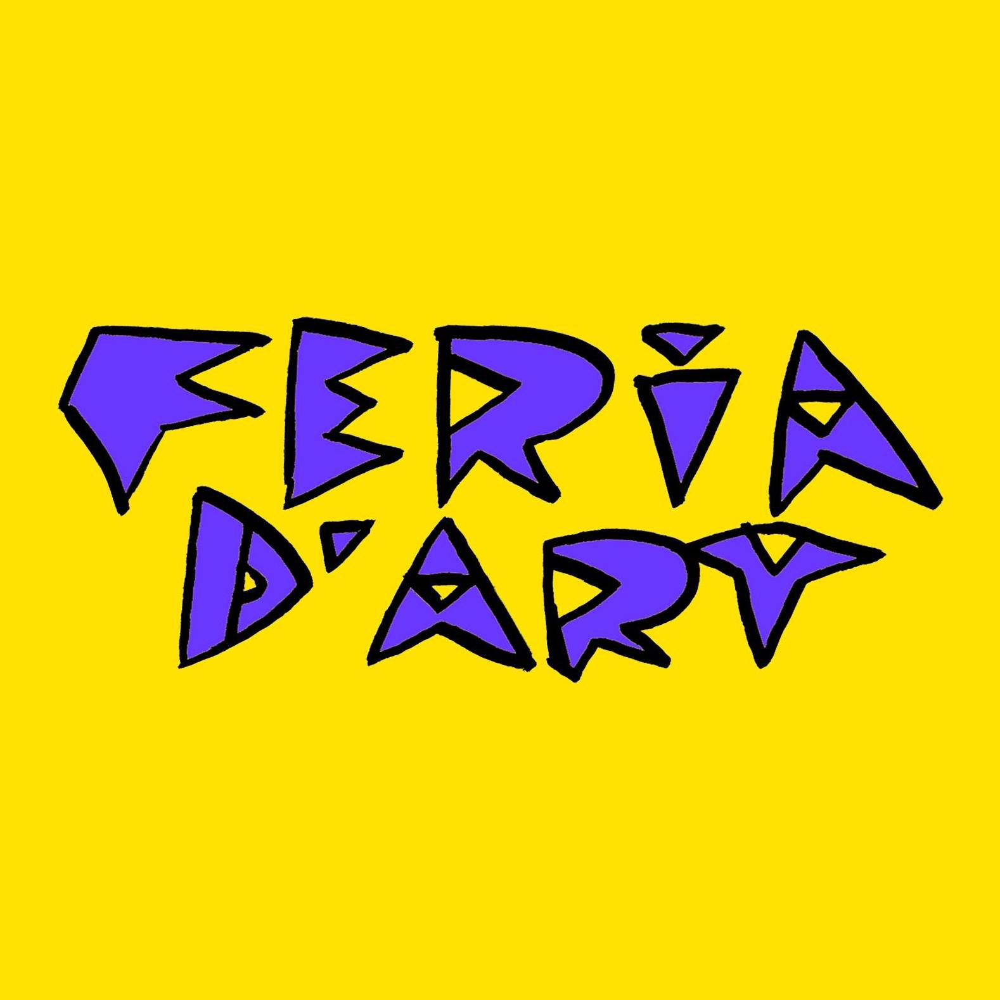

#  FERIA D'ART 

[See the actual site!](http://feriadart.art/)

The site has 4 different domain names: feriadart.org, feriadart.fr , feriadart.be and feriadart.art
all of them are redirected to http://feriadart.art/

The site was created for a non-profit art promoting association located in Brussels. It was made by WebDev students under the Umbrella of BeCode (campus Bruxelles). The challenge was to create a website for a real client. This partical project created in group started from scratch.

## HOME

The homepage is constructed out of 4 main components:

1. The artist-component gives a picture (work of an artist) plus informations about a random artist who is subscribed to an event (everytime you reload the page another artist will appear). 
When you click the button 'view more', you will be redirected to the artistspage where you can get more info and see more pictures with work of that artist.

 

 
 

2. The second section gives info about the upcoming event with a picture of the poster of the event. If you click the button 'Learn More' you can get more info about that event.
When the event is open to subsription you can subscribe, meaning create an artistpage, give more info about yourself as an artist and upload up to 5 pictures for your personal artistpage.
On the eventpage there is also a button 'view artists' where you can have a look at all the artists who are already subscribed to that particular event. 

 

 
 

3. The 'Next Events'-section links to events coming up in the future, with also the possibility to see the artists subsribed to that event.

 

 
 

4. The last section shows a collection of links to published articles.

 

 
 

Interesting fact! In the header there is a button that you can click to change the language of the site!

 

 
 

## ABOUT page

On the about page you cannot only find more text about the organization, you can also see the people currently working for the organization.
They each have a card with links to their personal facebook, website, instagram account or mail-address.

 

## EVENTS page

Links to all the events, see above for more information about the buttons and functionalities.

 

## GALLERY page

On the gallery-page you will find all the events. If you select a particual event you can have a look at all the pictures from that event.

 

## GUESTBOOK page

 
The guestbook-page shows all the comments left by people visiting the site. You can leave your personal comment on the wall. Once accepted it will appear as well.

 

## CONTACT page

 
This pages gives you the possibility to interact with the organization. Its a simple contact form that you will need to fill in to get in contact with Feria d'Art.

 

## FOOTER

The footer links to all the pages of the website, and also to the facebook and instagram page. Undeneath you will find the copyrights of the organization plus legal info.
In the footer there is a secret link incorporated to have acces to the backoffice of the site.
 

 
 

## Laravel section

## How to install in your computer through Linux Terminal
1. clone the repo to your computer
2. $ cd ASBL-Feriadart
3. $ composer install
4. $ npm install
5. $ cp .env.example .env
6. $ php artisan key:generate
7. $ php artisan serve

## Tailwind

The front-end part of the site is made with Tailwind in combination with some JavaScript. 
For the gallery we used Glide.js to create a carousel. 
